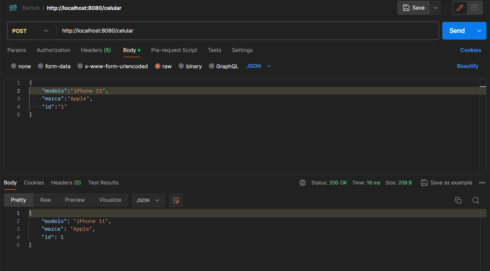
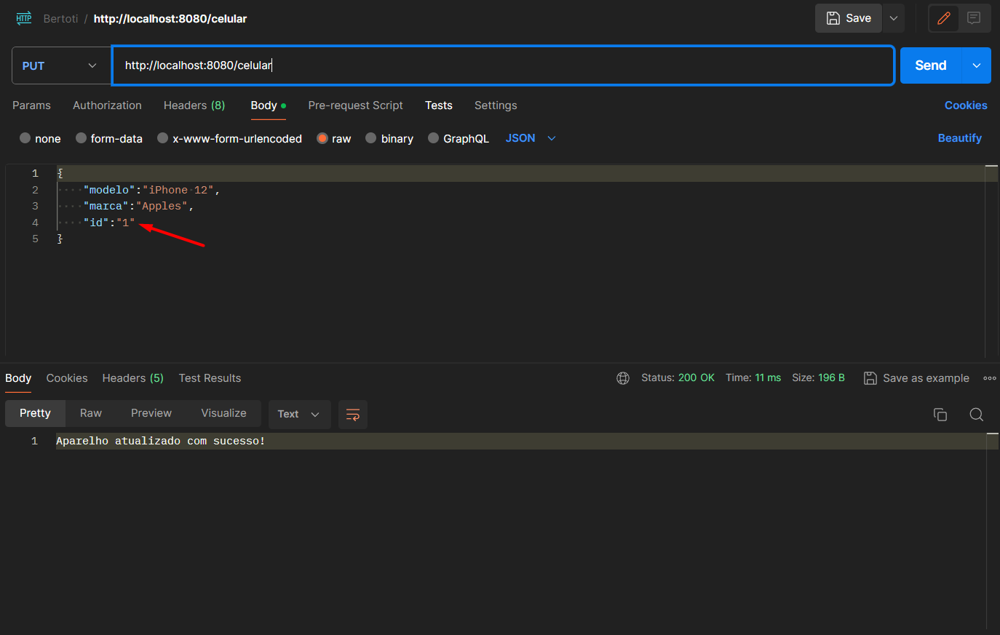
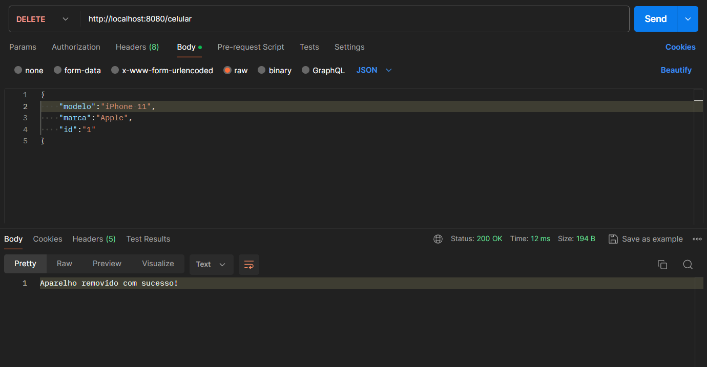
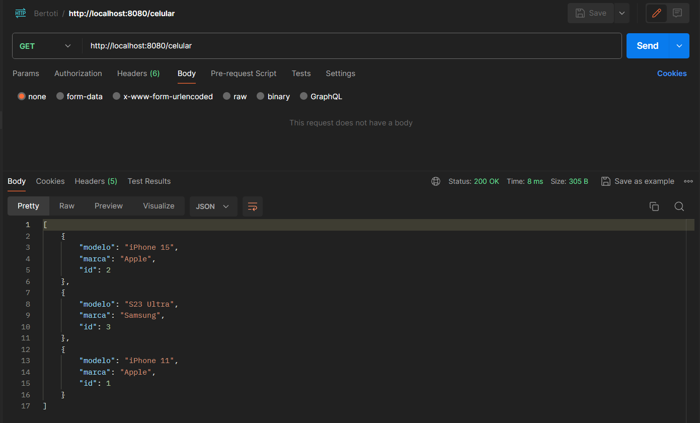

## Projeto CRUD com springboot
- Aplicação desenvolvida nas aulas de Laboratório III

### Preview testes requisições no Postman
- Adicionado um celular através da Requisição POST

- Atualizado o aparelho, filtrando pelo ID fornecido no body, requisição PUT

- Procura e deleta o aparelho, através do método DELETE

- Lista todos os aparelhos através do método GET
